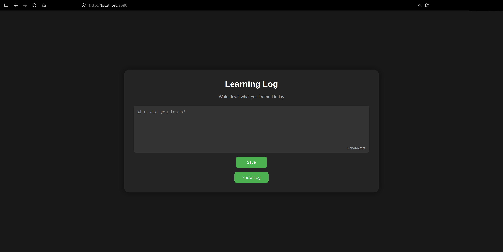

# Docker Learning Log

A simple web application for keeping track of daily learning progress.

This project was created to learn the fundamentals of Docker, Docker Compose, Python, nginx, and basic web development. Users can write learning notes through a web interface, save them, and view all previously saved entries.

---

## Features

* Write learning notes in the browser
* Save entries to a text file
* View the complete learning log
* Responsive web interface
* Character counter while typing
* Auto-resizing text area
* Docker Compose setup
* Python backend
* nginx reverse proxy

---

## Technologies

* Python
* Docker
* Docker Compose
* nginx
* HTML
* CSS
* JavaScript

---

## How to Run

Clone the repository:

```bash
git clone <repository-url>
```

Start the project:

```bash
docker compose up --build
```

Open your browser:

```
http://localhost:8080
```

---

## How It Works

1. The user opens the website.
2. nginx serves the HTML page.
3. The form sends a POST request to the Python API.
4. The API saves the text inside `learning_log.txt`.
5. The user can open the complete learning log from the website.

---

## What I Learned

During this project I learned:

* Creating Docker containers
* Using Docker Compose
* Configuring nginx as a reverse proxy
* Building a simple Python HTTP server
* Handling HTTP GET and POST requests
* Reading and writing files in Python
* Creating HTML forms
* Basic CSS styling
* Basic JavaScript for UI improvements
* Connecting multiple containers together

---

## Future Improvements

Possible future features:

* Edit existing entries
* Delete entries
* Search function
* SQLite database instead of a text file
* Markdown support
* User authentication
* Export log as PDF
* Better error handling

---

## Screenshot



---

## Purpose

This project was built as a learning project to better understand containerization, web servers, backend development, and communication between multiple services.

---

## License

This project is for educational purposes.
